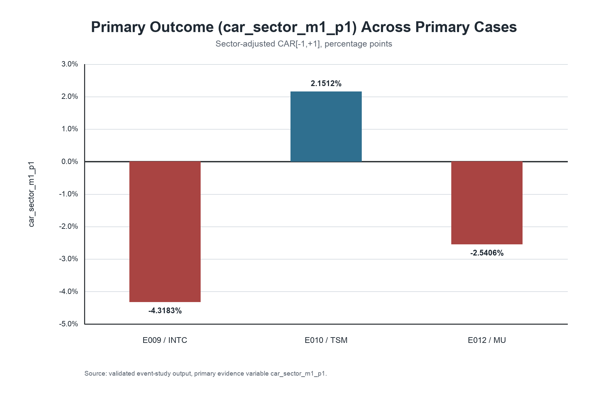

# Opportunity Under Geopolitical Competition

This repository contains a research portfolio on how geopolitical competition can create market opportunity for selected firms and sectors. The project focuses on cases where strategic importance and credible state support may lead investors to price geopolitical pressure as more than downside risk.

## At a Glance

| Component | Summary |
|---|---|
| Field | Political economy / geopolitical risk / financial markets |
| Method | Event-study analysis |
| Sector focus | Semiconductors and strategic industrial policy |
| Unit of analysis | Event-firm observation |
| Primary outcome | `car_sector_m1_p1` |
| Main finding | Mixed evidence: one supportive primary case and two theory-weakening primary cases |
| Portfolio value | Demonstrates theory-driven research design, financial event-study workflow, data validation, and reproducible analysis |

## What This Project Demonstrates

This project demonstrates how a political economy research question can be converted into a transparent empirical workflow. Rather than treating geopolitical competition only as a narrative risk factor, the project defines a testable mechanism, freezes coding decisions before return interpretation, links events to firms through documented event-asset relationships, and evaluates market reactions using sector-adjusted abnormal returns.

The main empirical finding is intentionally mixed: one primary case supports the proposed State Support mechanism, while two primary cases weaken it under the pre-committed classification rule. This makes the project stronger as a research portfolio artifact because it shows disciplined interpretation rather than result-chasing. The contribution is not a claim that state support always creates market opportunity, but a reproducible framework for evaluating when geopolitical state support is, or is not, reflected in market pricing.

## Research Question

When do financial markets interpret geopolitical competition as a source of opportunity for strategically important firms or sectors?

## Puzzle

Geopolitical competition is usually treated as a source of risk: uncertainty, restrictions, supply-chain disruption, and market-access loss. Yet some firms and sectors may gain when states respond with subsidies, procurement, protection, financing, or industrial-policy commitments. The puzzle is why markets sometimes price geopolitical pressure as opportunity for selected actors rather than only as aggregate risk.

## Core Theory

The proposed mechanism is state-backed opportunity:

```text
Geopolitical competition
        |
        v
Strategic importance
        |
        v
Expected state support
        |
        v
Investor interpretation
        |
        v
Market reaction
```

The theory does not claim that geopolitical competition is broadly positive for markets. It expects heterogeneous effects: firms exposed mainly to restrictions or uncertainty may lose value, while firms expected to receive credible support may experience positive reactions.

## Research Design

This project uses a focused event-study approach in semiconductors and semiconductor-linked strategic industrial policy. The unit of analysis is the event-firm observation. It compares named beneficiaries, eligible sector peers, threat-exposed firms, and market benchmarks around support and restriction events.

The primary outcome is `car_sector_m1_p1`: the sector-adjusted cumulative abnormal return over the [-1,+1] event window. Coding decisions for events, assets, and event-asset links were frozen before return interpretation.

## Project Status

- Theory Freeze Completed
- Research Design Freeze Completed
- Dataset Architecture Freeze Completed
- Event Study Pipeline Completed
- Validation Completed
- Dissertation Chapters 1–6 Completed
- Dissertation Figures and Tables Produced

## Validated Results

The validated primary sample contains three named-beneficiary semiconductor support events. Results are classified using the pre-committed primary outcome, `car_sector_m1_p1`.

| Event | Firm | Primary outcome: `car_sector_m1_p1` | Classification |
|---|---|---:|---|
| E009 | INTC | -4.3183% | Theory-weakening |
| E010 | TSM | 2.1512% | Supportive |
| E012 | MU | -2.5406% | Theory-weakening |

The validated evidence is mixed: one primary case is supportive, and two primary cases are theory-weakening under the pre-committed classification rule.

## Results Snapshot

- The primary evidence is mixed: E010 / TSM is supportive, while E009 / INTC and E012 / MU are theory-weakening under the pre-committed `car_sector_m1_p1` rule.
- Descriptive CAR[-7,+7] values show the same heterogeneity: TSM has the strongest positive wider-window movement, while MU remains negative and INTC is near zero.
- The recipient vs non-recipient comparison does not show systematic recipient outperformance, reinforcing the dissertation's cautious interpretation.

## Result Exhibits



![Descriptive CAR[-7,+7] Across Primary Cases](dissertation_results/figures/figure2_primary_case_descriptive_car_m7_p7.png)

Figure 1 summarizes the pre-committed primary outcome across the three validated primary cases. Figure 2 provides descriptive wider-window context. Figure 3 reports the recipient versus non-recipient comparison and is linked below.

Additional figure:

- [Figure 3: Recipient vs Non-Recipient Mean CAR Comparison](dissertation_results/figures/figure3_recipient_vs_nonrecipient_mean_car.png)

Tables:

- [Table 1: Primary Cases](dissertation_results/tables/table1_primary_cases.md)
- [Table 2: Support Event Summary Statistics](dissertation_results/tables/table2_support_event_summary_statistics.md)
- [Table 3: Recipient vs Non-Recipient Comparison](dissertation_results/tables/table3_recipient_vs_nonrecipient_comparison.md)

## Skills Demonstrated

- Research Design
- Event Study Methodology
- Data Engineering
- Financial Data Validation
- Reproducible Analytics
- Academic Research Communication

## Reproducibility

Run the event-study pipeline with:

```bash
python3 scripts/build_event_returns.py
```

Required inputs:

- `data/events.csv`
- `data/assets.csv`
- `data/event_asset_links.csv`
- `data/raw_prices/*.csv`

Expected outputs:

- `data/market_returns.csv`
- `data/event_firm_returns.csv`
- `data/local_price_validation_report.md`

## Historical Analog Dataset Layer

This repo now includes a structured historical-analog event layer that extends the dissertation event-study base into a broader qualitative comparison dataset. It supports comparison across event families, state-support signals, restriction or pressure signals, surprise levels, and observed market pathways.

The historical analog layer is for research comparison and decision-support framing only. It does not make forecasts or investment recommendations.

- [Historical analog events](data/historical_analog_events.csv)
- [Historical analog dataset methodology](docs/historical_analog_dataset_methodology.md)
- [Historical analog dataset summary](docs/historical_analog_dataset_summary.md)

## Repository Structure

- `docs/`: frozen research design, protocol, theory, sample, and dataset documentation.
- `data/`: event, asset, and event-asset link tables, plus local raw price inputs when available.
- `scripts/`: reproducible scripts for building market return and event-study files.

## Academic Status

This repository contains research materials, code, documentation, figures, tables, and summarized findings associated with an academic dissertation project. It is intended for research transparency, reproducibility, and portfolio presentation. It is not a peer-reviewed publication, and the full dissertation manuscript is not included in this repository.
