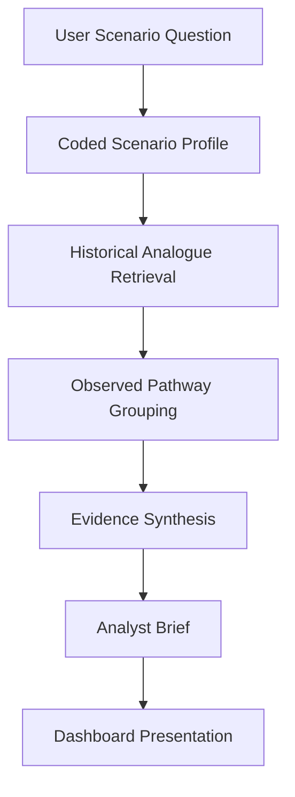
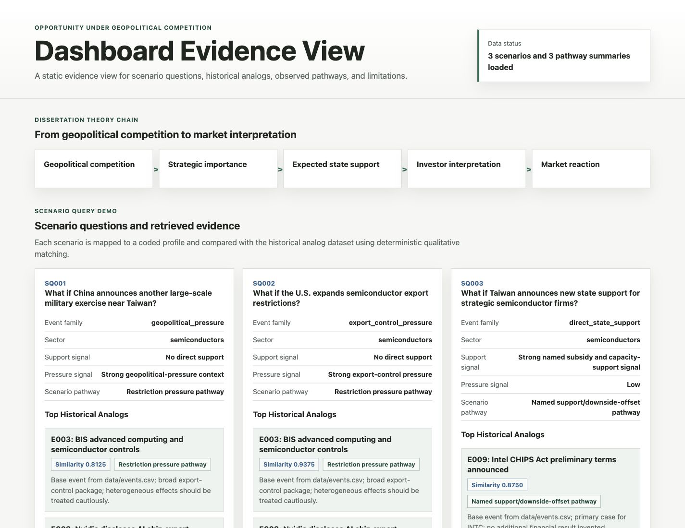
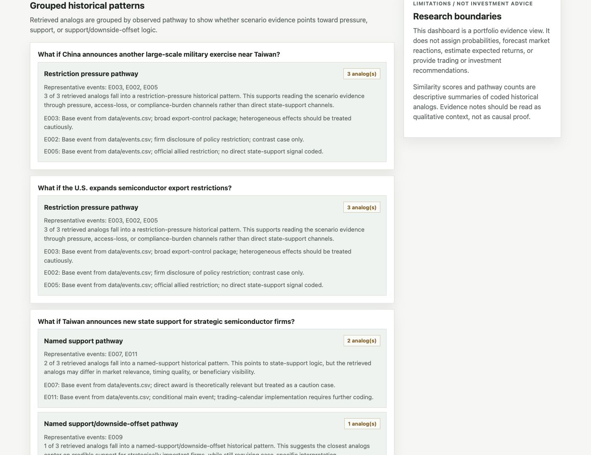

# Opportunity Under Geopolitical Competition

A dissertation-based geopolitical risk analytics project that transforms event-study research into historical analogue scenario analysis.

## At a Glance

This repository is a Geopolitical Intelligence Automation System. It retrieves historical analogues, identifies observed pathways, and generates structured evidence summaries for analyst review.

It is not a forecasting system, trading system, or investment recommendation engine.

Core portfolio artefacts:

- [Repository case study](docs/repo_case_study.md)
- [Product architecture](docs/product_architecture.md)
- [Recruiter summary](docs/recruiter_summary.md)
- [Dashboard evidence view](dashboard/index.html)

## Business Problem

Geopolitical risk is often communicated through narrative judgement. That makes it difficult for analysts to compare new scenarios against historical evidence, inspect why a case was selected, and separate evidence from speculation.

This project addresses that problem by turning a dissertation research base into a structured, reproducible analytics workflow for historical comparison.

## Product Overview

The product converts coded geopolitical events into scenario evidence:


The system is deterministic and auditable. It uses coded event features, transparent similarity logic, evidence notes, and analyst caveats.

## Intelligence Workflow



Each layer preserves traceability back to the historical analogue dataset. The workflow supports scenario assessment, not prediction.

## Evidence Transparency

The Evidence Transparency Layer explains why each analogue was retrieved. It shows:

- match dimensions;
- partial matches;
- differences;
- deterministic similarity explanation;
- divergence explanation;
- evidence metadata;
- analyst caveats.

This improves analytical credibility by making the retrieval logic visible to analysts, recruiters, and academic reviewers.

## Dashboard Views

The static dashboard includes:

- Product Hero with evidence-base KPIs;
- Evidence Transparency;
- Scenario Query View;
- Analyst Briefs;
- Observed Pathways;
- Dataset Coverage Dashboard;
- research limitations and not-investment-advice boundaries.

Run locally:

```bash
python3 -m http.server 8000
```

Then open:

```text
http://127.0.0.1:8000/dashboard/
```

## What This Demonstrates

- Research-to-product translation
- Geopolitical risk analytics
- Historical analogue retrieval
- Deterministic scenario analysis
- Evidence transparency and explainability
- Analyst brief generation
- Dashboard communication
- Reproducible analytics packaging

## Recruiter Takeaways

This project demonstrates the ability to move from an ambiguous strategic-risk problem to a working analytics product. It combines research judgement, data structuring, Python automation, deterministic retrieval, dashboard design, and portfolio storytelling.

The strongest fit is for roles in business analytics, risk analytics, strategy analytics, geopolitical intelligence, market intelligence, and decision-support product analytics.

## Project Value Chain

```text
Dissertation Research
        ↓
Structured Event Dataset
        ↓
Historical Similarity Engine
        ↓
Scenario Query Demo
        ↓
Observed Pathway Engine
        ↓
Dashboard Evidence View
```

## System Evolution Roadmap

```text
Dissertation Research
        ↓
Historical Analogue Dataset
        ↓
Similarity Engine
        ↓
Scenario Assistant
        ↓
Intelligence System Foundation
        ↓
Future Automation Expansion
```

Phase 3 adds the operating foundation for a continuously updated geopolitical intelligence system. It defines how raw information sources become candidate events, how human review protects dataset quality, and how approved events flow into the historical analogue, similarity, scenario, observed pathway, and dashboard layers.

- [Intelligence system architecture](docs/intelligence_system_architecture.md)
- [Source registry](data/source_registry.csv)
- [Source registry methodology](docs/source_registry_methodology.md)
- [Event monitoring framework](docs/event_monitoring_framework.md)
- [Dataset update protocol](docs/dataset_update_protocol.md)
- [Analyst workbench guide](docs/analyst_workbench_guide.md)
- [Roadmap V2](docs/roadmap_v2.md)

This roadmap is an architecture and workflow foundation. It does not add scraping, LLM APIs, forecasting, or investment advice.

## Intelligence Operations Layer

```text
Source Registry
        ↓
Review Queue
        ↓
Approved Dataset
        ↓
Similarity Engine
        ↓
Scenario Assistant
        ↓
Observed Pathways
        ↓
Operations Dashboard
```

Phase 4 adds a semi-automated intelligence workflow around the existing research and analytics system. Candidate events move through a review queue before any approved dataset update, dataset changes are logged, and the pipeline orchestrator regenerates validation, coverage, similarity, scenario, pathway, and dashboard health outputs.

- [Event review queue](data/event_review_queue.csv)
- [Event review queue methodology](docs/event_review_queue_methodology.md)
- [Dataset change log](data/dataset_change_log.csv)
- [Dataset governance](docs/dataset_governance.md)
- [Pipeline orchestrator](scripts/pipeline_orchestrator.py)
- [System health report script](scripts/system_health_report.py)
- [System health methodology](docs/system_health_methodology.md)
- [Portfolio case study V2](docs/portfolio_case_study_v2.md)

Run the operations pipeline with:

```bash
python3 scripts/pipeline_orchestrator.py
```

The operations layer supports reproducibility and operational scalability. It does not scrape websites, call LLM APIs, forecast outcomes, or provide investment advice.

## Evidence-to-Decision Layer

```text
Historical Events
        ↓
Historical Analogues
        ↓
Observed Pathways
        ↓
Evidence Synthesis
        ↓
Analyst Brief
```

Phase 5 adds deterministic analyst briefs that synthesise scenario descriptions, relevant historical analogues, observed pathways, evidence notes, caveats, and research limitations. This layer turns structured historical evidence into a readable analyst brief without adding forecasts, probabilities, expected-return estimates, investment recommendations, or LLM API calls.

The repository now supports structured historical evidence retrieval and analyst-oriented scenario assessment.

- [Analyst brief generator](scripts/generate_analyst_briefs.py)
- [Analyst briefs output](results/analyst_briefs.json)
- [Evidence synthesis framework](docs/evidence_synthesis_framework.md)
- [Analyst brief methodology](docs/analyst_brief_methodology.md)
- [Research to decision support](docs/research_to_decision_support.md)
- [Decision support principles](docs/decision_support_principles.md)

Generate briefs with:

```bash
python3 scripts/generate_analyst_briefs.py
```

## Evidence Transparency Layer

The dashboard now includes an evidence transparency layer that explains why each historical analogue was retrieved. For every top analogue, it shows matched dimensions, differences, deterministic similarity rationale, evidence metadata, and analyst caveats.

This improves analytical credibility by making retrieval logic visible:

- why the analogue was selected;
- which fields matched or partially matched;
- which fields differed;
- what evidence note supports the pathway;
- what limitations analysts should keep in view.

For intelligence workflows, this matters because analyst users need traceability before relying on a scenario comparison. For portfolio review, it demonstrates explainable analytics engineering rather than a black-box dashboard. The layer remains descriptive: it does not forecast, assign probabilities, or provide investment advice.

## Research Quality and Coverage Layer

```text
Event Collection
        ↓
Dataset Expansion
        ↓
Coverage Analytics
        ↓
Evidence Gap Assessment
        ↓
Analyst Brief System
```

This layer strengthens the evidence base that supports historical analogue retrieval and analyst briefs. It defines event-family coding rules, staged dataset expansion milestones, event collection standards, coverage analytics, evidence-gap assessment, and research quality controls.

- [Event family taxonomy V2](docs/event_family_taxonomy_v2.md)
- [Event expansion framework](docs/event_expansion_framework.md)
- [Event collection protocol V2](docs/event_collection_protocol_v2.md)
- [Dataset coverage analysis script](scripts/dataset_coverage_analysis.py)
- [Dataset coverage report](results/dataset_coverage_report.json)
- [Dataset coverage summary](results/dataset_coverage_summary.csv)
- [Evidence gap assessment](docs/evidence_gap_assessment.md)
- [Research quality framework](docs/research_quality_framework.md)
- [Dataset validation framework](docs/dataset_validation_framework.md)

The coverage layer is descriptive. It helps identify where future sourced collection should improve the dataset; it does not provide forecasts, probabilities, or investment advice.

## Live / Local Dashboard Preview

Run the static dashboard locally from the repository root:

```bash
python3 -m http.server 8000
```

Then open:

```text
http://127.0.0.1:8000/dashboard/
```

The dashboard displays scenario questions, top historical analogues, similarity scores, observed pathways, evidence notes, and limitations. It uses no external JavaScript libraries, no build step, and no LLM API calls.

## Dashboard Preview





## Key Outputs

- [Historical analogue dataset](data/historical_analogue_events.csv)
- [Historical similarity matrix](results/historical_similarity_matrix.csv)
- [Scenario query demo results](results/scenario_query_demo_results.json)
- [Observed pathway summaries](results/observed_pathways.json)
- [Dashboard evidence view](dashboard/index.html)
- [Portfolio case study](docs/portfolio_case_study.md)
- [Recruiter summary](docs/recruiter_summary.md)
- [Technical architecture](docs/technical_architecture.md)
- [Project limitations](docs/project_limitations.md)

## How It Works

1. Events are coded from the dissertation research base into a structured historical analogue dataset.
2. Similarity is calculated deterministically across qualitative event features.
3. Scenario questions are mapped to coded profiles and retrieve the closest historical analogues.
4. Retrieved analogues are grouped into observed pathways with representative events and evidence notes.
5. The dashboard displays the scenario evidence in a readable static interface.

## Reproducibility

Run the deterministic historical analogue release checks with:

```bash
python3 scripts/run_all_checks.py
```

Launch the dashboard with:

```bash
python3 -m http.server 8000
```

Then open:

```text
http://127.0.0.1:8000/dashboard/
```

For detailed instructions, see [Reproducibility Guide](docs/reproducibility_guide.md).

## What This Demonstrates

- Geopolitical risk research
- Event-study thinking
- Structured dataset design
- Deterministic analytics pipeline
- Scenario analysis
- Dashboard communication
- Reproducible project packaging

## Limitations

This project is descriptive historical analysis only. It does not claim forecast accuracy, provide investment advice, or estimate expected returns. The sample is intentionally limited and semiconductors-focused, and several fields rely on qualitative coding. For the full limitations statement, see [Project limitations](docs/project_limitations.md).

## Future Dataset Expansion

The current historical analogue dataset is intentionally limited and mirrors the dissertation event base. Future versions should expand event coverage across military exercises, diplomatic shocks, sanctions, leadership meetings, supply-chain relocation, technology restrictions, strategic investment, and semiconductor expansion cases.

A larger, better-balanced evidence base will improve historical comparison and scenario retrieval, but only if new events are sourced and coded conservatively. See [Event expansion plan](docs/event_expansion_plan.md), [Event family taxonomy V2](docs/event_family_taxonomy_v2.md), and [Event collection protocol](docs/event_collection_protocol.md).

## Dataset Production Pipeline

New events should move through a standardised production workflow: identification, eligibility screening, event-family assignment, coding, quality review, dataset integration, and validation. The workflow keeps source requirements, coding rules, and review steps explicit before an event enters the analytical system.

Use [Event coding workflow](docs/event_coding_workflow.md), [Event coding template](docs/event_coding_template.md), and [Dataset growth dashboard](docs/dataset_growth_dashboard.md) when preparing new rows. Validate a single candidate event with:

```bash
python3 scripts/validate_event_entry.py path/to/event_record.json
```

After approved events are integrated into `data/historical_analogue_events.csv`, run:

```bash
python3 scripts/run_all_checks.py
```

## Dataset Coverage Analytics

Coverage monitoring tracks how the historical analogue dataset is distributed across event families, sectors, geographies, strategic-importance levels, surprise levels, and state-support signals. This helps identify evidence gaps before adding new events.

Current coverage analysis is generated by [dataset coverage analysis script](scripts/dataset_coverage_analysis.py) and written to [dataset coverage report](results/dataset_coverage_report.json) and `results/dataset_coverage_summary.csv`. The findings are summarised in [dataset coverage analysis](docs/dataset_coverage_analysis.md) and [evidence gap assessment](docs/evidence_gap_assessment.md).

Future expansion should prioritise underrepresented event families and regions rather than simply adding more semiconductor subsidy cases.

## Automation and Search Foundation

The repo now includes a prototype foundation for future event-ingestion automation and local historical analogue search. The ingestion prototype creates unverified candidate records only; candidates remain separate from approved historical analogue events until human review and validation.

- [Event ingestion prototype](scripts/event_ingestion_prototype.py)
- [Prototype ingestion candidates](results/event_ingestion_candidates.json)
- [Candidate events template](data/candidate_events_template.csv)
- [Candidate event review workflow](docs/candidate_event_review_workflow.md)
- [Historical analogue search CLI](scripts/search_historical_analogues.py)
- [Automation and search foundation summary](docs/automation_and_search_foundation_summary.md)

Example commands:

```bash
python3 scripts/event_ingestion_prototype.py
python3 scripts/search_historical_analogues.py "military exercise"
python3 scripts/search_historical_analogues.py "export restriction"
```

## Interactive Scenario Assistant v1

The repo now includes a static interactive scenario assistant. Users can select predefined geopolitical or industrial-policy scenarios, retrieve similar historical analogues, and review observed pathway summaries from the current evidence base.

The assistant is deterministic and evidence-based. It uses no LLM API calls, does not scrape websites, does not forecast outcomes, and does not provide investment advice.

- [Scenario profiles template](data/scenario_profiles_template.csv)
- [Sample scenario profiles](data/sample_scenario_profiles.csv)
- [Scenario profile analyser](scripts/analyse_scenario_profile.py)
- [Interactive scenario analysis output](results/interactive_scenario_analysis.json)
- [Interactive scenario assistant methodology](docs/interactive_scenario_assistant_methodology.md)
- [Interactive scenario assistant summary](docs/interactive_scenario_assistant_summary.md)

Run the analyser with:

```bash
python3 scripts/analyse_scenario_profile.py
```

## Repository Map

- `data/`: dissertation event data, asset links, market outputs, raw price inputs, and historical analogue dataset.
- `scripts/`: validation, event-study, similarity, scenario query, observed pathway, figure, and release-check scripts.
- `results/`: generated similarity, scenario query, and observed pathway outputs.
- `dashboard/`: static evidence view.
- `docs/`: methodology, architecture, portfolio, reproducibility, audit, and limitation documents.
- `dissertation_results/`: dissertation figures, tables, captions, and source notes.

## At a Glance

| Component | Summary |
|---|---|
| Field | Political economy / geopolitical risk / financial markets |
| Method | Event-study analysis |
| Sector focus | Semiconductors and strategic industrial policy |
| Unit of analysis | Event-firm observation |
| Primary outcome | `car_sector_m1_p1` |
| Main finding | Mixed evidence: one supportive primary case and two theory-weakening primary cases |
| Portfolio value | Demonstrates theory-driven research design, financial event-study workflow, data validation, and reproducible analysis |

## Detailed Dissertation Framing

This project demonstrates how a political economy research question can be converted into a transparent empirical workflow. Rather than treating geopolitical competition only as a narrative risk factor, the project defines a testable mechanism, freezes coding decisions before return interpretation, links events to firms through documented event-asset relationships, and evaluates market reactions using sector-adjusted abnormal returns.

The main empirical finding is intentionally mixed: one primary case supports the proposed State Support mechanism, while two primary cases weaken it under the pre-committed classification rule. This makes the project stronger as a research portfolio artefact because it shows disciplined interpretation rather than result-chasing. The contribution is not a claim that state support always creates market opportunity, but a reproducible framework for evaluating when geopolitical state support is, or is not, reflected in market pricing.

## Research Question

When do financial markets interpret geopolitical competition as a source of opportunity for strategically important firms or sectors?

## Puzzle

Geopolitical competition is usually treated as a source of risk: uncertainty, restrictions, supply-chain disruption, and market-access loss. Yet some firms and sectors may gain when states respond with subsidies, procurement, protection, financing, or industrial-policy commitments. The puzzle is why markets sometimes price geopolitical pressure as opportunity for selected actors rather than only as aggregate risk.

## Core Theory

The proposed mechanism is state-backed opportunity:

```text
Geopolitical competition
        |
        v
Strategic importance
        |
        v
Expected state support
        |
        v
Investor interpretation
        |
        v
Market reaction
```

The theory does not claim that geopolitical competition is broadly positive for markets. It expects heterogeneous effects: firms exposed mainly to restrictions or uncertainty may lose value, while firms expected to receive credible support may experience positive reactions.

## Research Design

This project uses a focused event-study approach in semiconductors and semiconductor-linked strategic industrial policy. The unit of analysis is the event-firm observation. It compares named beneficiaries, eligible sector peers, threat-exposed firms, and market benchmarks around support and restriction events.

The primary outcome is `car_sector_m1_p1`: the sector-adjusted cumulative abnormal return over the [-1,+1] event window. Coding decisions for events, assets, and event-asset links were frozen before return interpretation.

## Project Status

- Theory Freeze Completed
- Research Design Freeze Completed
- Dataset Architecture Freeze Completed
- Event Study Pipeline Completed
- Validation Completed
- Dissertation Chapters 1–6 Completed
- Dissertation Figures and Tables Produced

## Validated Results

The validated primary sample contains three named-beneficiary semiconductor support events. Results are classified using the pre-committed primary outcome, `car_sector_m1_p1`.

| Event | Firm | Primary outcome: `car_sector_m1_p1` | Classification |
|---|---|---:|---|
| E009 | INTC | -4.3183% | Theory-weakening |
| E010 | TSM | 2.1512% | Supportive |
| E012 | MU | -2.5406% | Theory-weakening |

The validated evidence is mixed: one primary case is supportive, and two primary cases are theory-weakening under the pre-committed classification rule.

## Results Snapshot

- The primary evidence is mixed: E010 / TSM is supportive, while E009 / INTC and E012 / MU are theory-weakening under the pre-committed `car_sector_m1_p1` rule.
- Descriptive CAR[-7,+7] values show the same heterogeneity: TSM has the strongest positive wider-window movement, while MU remains negative and INTC is near zero.
- The recipient vs non-recipient comparison does not show systematic recipient outperformance, reinforcing the dissertation's cautious interpretation.

## Result Exhibits


![Descriptive CAR[-7,+7] Across Primary Cases](dissertation_results/figures/figure2_primary_case_descriptive_car_m7_p7.png)

Figure 1 summarises the pre-committed primary outcome across the three validated primary cases. Figure 2 provides descriptive wider-window context. Figure 3 reports the recipient versus non-recipient comparison and is linked below.

Additional figure:

- [Figure 3: Recipient vs Non-Recipient Mean CAR Comparison](dissertation_results/figures/figure3_recipient_vs_nonrecipient_mean_car.png)

Tables:

- [Table 1: Primary Cases](dissertation_results/tables/table1_primary_cases.md)
- [Table 2: Support Event Summary Statistics](dissertation_results/tables/table2_support_event_summary_statistics.md)
- [Table 3: Recipient vs Non-Recipient Comparison](dissertation_results/tables/table3_recipient_vs_nonrecipient_comparison.md)

## Skills Demonstrated

- Research Design
- Event Study Methodology
- Data Engineering
- Financial Data Validation
- Reproducible Analytics
- Academic Research Communication

## Dissertation Event-Study Reproducibility

Run the dissertation event-study pipeline with:

```bash
python3 scripts/build_event_returns.py
```

Required inputs:

- `data/events.csv`
- `data/assets.csv`
- `data/event_asset_links.csv`
- `data/raw_prices/*.csv`

Expected outputs:

- `data/market_returns.csv`
- `data/event_firm_returns.csv`
- `data/local_price_validation_report.md`

## Historical Analogue Dataset Layer

This repo now includes a structured historical-analogue event layer that extends the dissertation event-study base into a broader qualitative comparison dataset. It supports comparison across event families, state-support signals, restriction or pressure signals, surprise levels, and observed market pathways.

The historical analogue layer is for research comparison and decision-support framing only. It does not make forecasts or investment recommendations.

- [Historical analogue events](data/historical_analogue_events.csv)
- [Historical analogue dataset methodology](docs/historical_analogue_dataset_methodology.md)
- [Historical analogue dataset summary](docs/historical_analogue_dataset_summary.md)

## Historical Similarity Engine

The repo also includes a deterministic pairwise event-comparison script for the historical analogue layer. The engine compares coded qualitative features across events and writes a transparent similarity matrix for historical research use.

The similarity output is not a forecast, trading signal, or investment recommendation.

- [Similarity engine script](scripts/calculate_historical_similarity.py)
- [Similarity matrix output](results/historical_similarity_matrix.csv)
- [Similarity engine methodology](docs/historical_similarity_engine_methodology.md)
- [Similarity engine summary](docs/historical_similarity_engine_summary.md)

## Scenario Query Demo Layer

The repo can now answer example scenario questions using deterministic historical analogue retrieval. The demo maps hard-coded scenario questions to coded profiles, compares them against the historical analogue dataset, and returns the closest documented events.

The demo uses no LLM API calls and is a portfolio demonstration, not a forecasting model. It does not provide trading or investment advice.

- [Scenario query demo script](scripts/run_scenario_query_demo.py)
- [Scenario query demo results](results/scenario_query_demo_results.json)
- [Scenario query demo methodology](docs/scenario_query_demo_methodology.md)
- [Scenario query demo summary](docs/scenario_query_demo_summary.md)

## Observed Pathway Engine

The repo now summarises observed post-event pathways from similar historical analogues. This supports structured scenario analysis by grouping retrieved analogues into pathway counts, representative events, and evidence notes.

The pathway output does not assign probabilities and does not provide investment advice.

- [Observed pathway engine script](scripts/generate_observed_pathways.py)
- [Observed pathway output](results/observed_pathways.json)
- [Observed pathway engine methodology](docs/observed_pathway_engine_methodology.md)
- [Observed pathway engine summary](docs/observed_pathway_engine_summary.md)

## Dashboard Evidence View

The repo includes a static dashboard evidence view for scenario questions, top historical analogues, similarity scores, observed pathways, evidence notes, and limitations. It uses no external JavaScript libraries, no build step, and no LLM API calls.

Run it locally from the repository root:

```bash
python3 -m http.server 8000
```

Then open:

```text
http://127.0.0.1:8000/dashboard/
```

The dashboard is an evidence view, not a forecasting model or investment-advice tool.

- [Dashboard page](dashboard/index.html)
- [Dashboard script](dashboard/app.js)
- [Dashboard styles](dashboard/styles.css)
- [Dashboard evidence view summary](docs/dashboard_evidence_view_summary.md)

## Repository Structure

- `docs/`: frozen research design, protocol, theory, sample, and dataset documentation.
- `data/`: event, asset, and event-asset link tables, plus local raw price inputs when available.
- `scripts/`: reproducible scripts for building market return and event-study files.

## Academic Status

This repository contains research materials, code, documentation, figures, tables, and summarised findings associated with an academic dissertation project. It is intended for research transparency, reproducibility, and portfolio presentation. It is not a peer-reviewed publication, and the full dissertation manuscript is not included in this repository.
