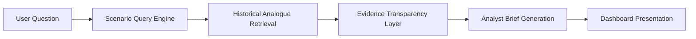

# Product Architecture

## Overview

This repository is organised as a deterministic intelligence workflow:

The architecture is designed for explainable scenario analysis. It does not forecast, trade, or provide investment advice.

## User Question

A user begins with a scenario question, such as:

> What if China announces another large-scale military exercise near Taiwan?

The question is mapped to a coded scenario profile. The profile uses the same feature language as the historical analogue dataset: event family, sector, strategic importance, support signal, pressure signal, surprise level, market interpretation, and observed pathway.

## Scenario Query Engine

The scenario query engine is implemented in `scripts/run_scenario_query_demo.py`.

It compares each scenario profile against the approved historical analogue dataset. Matching is deterministic and weighted, with event family, sector, pathway, and pressure context carrying more importance than generic fields.

The output is written to `results/scenario_query_demo_results.json`.

## Historical Analogue Retrieval

The retrieval layer returns the top historical analogues for each scenario. Each analogue includes:

- event ID;
- event date;
- event title;
- similarity score;
- matched fields;
- different fields;
- observed pathway;
- evidence note.

This layer supports historical comparison. It does not claim that similar events will produce the same future outcome.

## Evidence Transparency Layer

The Evidence Transparency Layer explains the retrieval logic. For every analogue, it shows whether key dimensions are:

- `Match`;
- `Partial Match`;
- `Different`.

The layer also provides deterministic explanation text, divergence text, event metadata, coverage classification, and analyst caveats.

This is the main explainability layer in the product. It helps analysts understand not only what was retrieved, but why it was retrieved and where it differs.

## Analyst Brief Generation

The analyst brief generator is implemented in `scripts/generate_analyst_briefs.py`.

It converts retrieved analogues and observed pathways into structured brief objects. Each brief includes:

- scenario description;
- most relevant historical analogues;
- observed historical pathways;
- key evidence;
- analytical caveats;
- research limitations;
- analyst note.

The brief generator uses deterministic templates. It does not use LLM APIs.

## Dashboard Presentation

The dashboard is a static product interface in `dashboard/`.

It presents:

- product hero and evidence-base KPIs;
- Evidence Transparency Layer;
- scenario query results;
- analyst briefs;
- observed pathways;
- dataset coverage;
- research limitations.

The dashboard loads static JSON outputs from `results/`. It has no backend, no external API calls, and no forecasting layer.

## Architecture Boundaries

The product is intentionally bounded:

- descriptive historical analysis only;
- no probability estimates;
- no expected-return estimates;
- no trading recommendations;
- no investment advice;
- no LLM-generated claims.

Its value is traceable evidence synthesis for analyst review.
