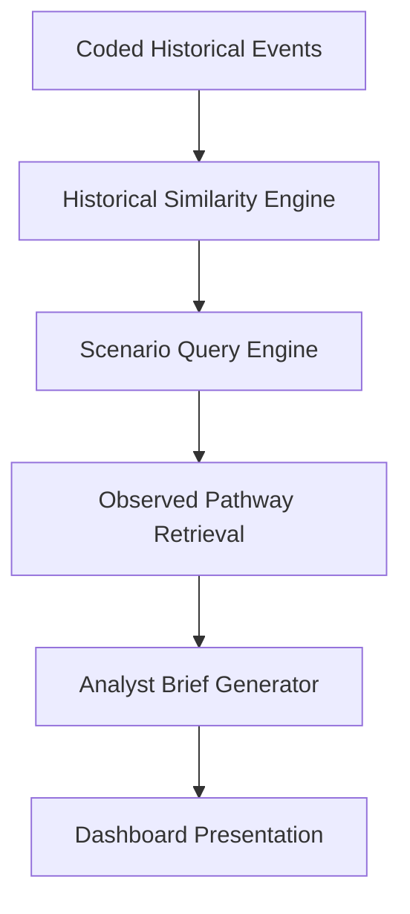

# Repository Case Study

## Problem

Geopolitical risk analysis often produces narrative commentary but leaves analysts with limited structure for comparing current scenarios against historical evidence. The problem is not simply knowing that geopolitical competition matters; it is understanding which past events are comparable, why they are comparable, what observed pathways followed, and what caveats limit interpretation.

This repository addresses that problem by turning dissertation research into a reproducible geopolitical intelligence workflow.

## Why Existing Approaches Are Limited

Common approaches are limited in several ways:

- Narrative reports can be difficult to audit.
- Event lists often lack consistent coding.
- Scenario discussion may mix evidence, judgement, and recommendation.
- Dashboards can show outputs without explaining why those outputs were retrieved.
- Black-box tools may obscure the link between source evidence and analyst conclusions.

This project takes a different approach: deterministic retrieval, visible coding, transparent evidence notes, and explicit limitations.

## Solution

The repository implements a Geopolitical Intelligence Automation System. It retrieves historical analogues, groups observed pathways, and generates structured analyst briefs for scenario review.

The system is not a forecasting engine, trading system, or investment recommendation product. It is a historical evidence synthesis workflow designed to support analyst judgement.

## Dataset

The current evidence base is `data/historical_analogue_events.csv`. It contains coded geopolitical and strategic-sector events across semiconductors, AI infrastructure, energy security, defence systems, critical minerals, telecommunications infrastructure, and supply-chain resilience.

Each event includes:

- event date and title;
- event family;
- country or region;
- affected sector;
- strategic-importance coding;
- state-support signal;
- restriction or pressure signal;
- surprise level;
- market interpretation label;
- observed pathway;
- evidence note.

The dataset is deliberately transparent. Uncertain coding should remain `TBD` or `Not coded` rather than being forced into false precision.

## Intelligence Workflow

The workflow starts with approved historical events. Similarity scoring compares coded fields, scenario queries retrieve the most relevant analogues, observed pathways summarise post-event patterns, and analyst briefs convert the evidence into structured review outputs.

## Evidence Transparency Layer

The Evidence Transparency Layer explains why each analogue appears in a scenario result. For every retrieved analogue, it displays:

- match dimensions;
- partial matches;
- differences;
- deterministic similarity explanation;
- divergence explanation;
- event metadata;
- evidence notes;
- analyst caveats.

This improves analytical credibility because users can inspect the retrieval logic rather than accepting a score without context.

## Results

The repository now demonstrates:

- a historical analogue dataset with strategic-sector coverage;
- deterministic similarity scoring;
- scenario query retrieval;
- observed pathway grouping;
- analyst brief generation;
- evidence transparency in the dashboard;
- reproducible validation and output regeneration.

The results are descriptive. They support structured comparison but do not claim future outcomes, probabilities, expected returns, or investment guidance.

## Portfolio Significance

This project shows the full analytics product arc:

- research framing;
- data architecture;
- deterministic analytics;
- evidence synthesis;
- explainable dashboard communication;
- portfolio-ready documentation.

For a recruiter or professor, the repository demonstrates that the project is not only a dissertation artefact. It is also an analytics product that translates complex geopolitical evidence into auditable decision-support outputs.
